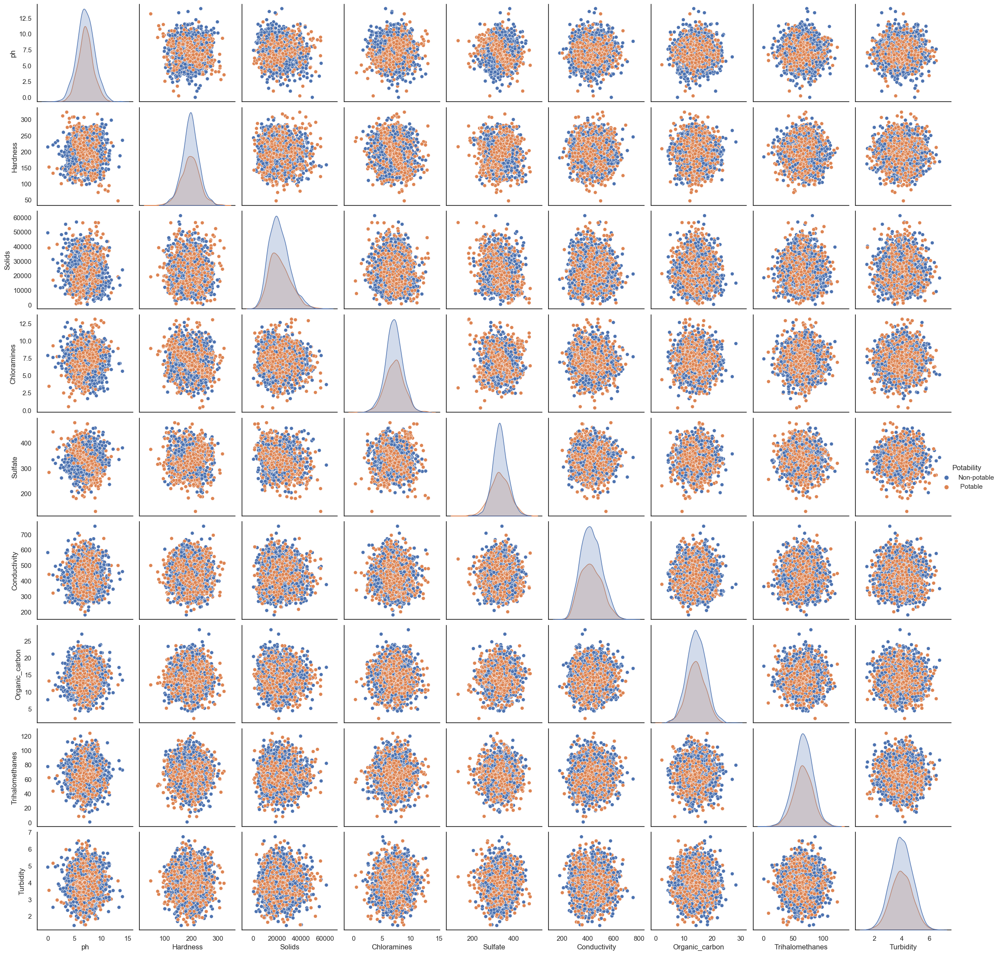

<div style="text-align: right"> [BACK](C:/Users/hooke/Desktop/my-website/j-hook.github.io/_site/projects.html) </div>

<br>

```{r setup, include=FALSE}
knitr::opts_chunk$set(echo = FALSE)
```
### Predicting the Potability of Water

This is the first part of an exploratory data analysis project examining characteristics of about 3000 water samples in relation to potability. I obtained this data project as part of the beta testing of the <a href="https://www.lonelyoctopus.com/" rel="noopener noreferrer" target="_blank">Lonely Octopus</a>. It comprises 9 primary water sampling characteristics and a binary outcome indicating the sample was potable or not. In the first stage of this project, I focused utilizing loops in python to visualize the data. You can preview the results <a href="water-quality-project.html" target="_blank"><b>here</b></a> and find the Jupyter Notebook syntax on <a href="https://github.com/j-hook/Side-Projects/tree/main/Water%20Quality%20EDA" rel="noopener noreferrer" target="_blank"><b>GitHub</b></a>.


```{r, echo=FALSE, fig.cap="A correlation plot of each of the 9 water potability characteristics."}

```

