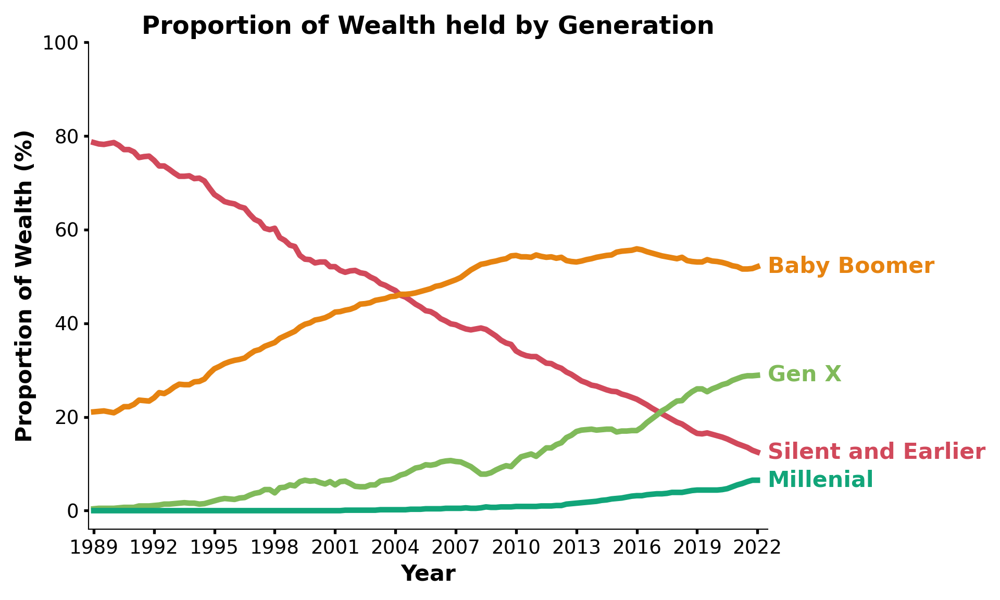

```{r setup, include=FALSE}
knitr::opts_chunk$set(echo = FALSE)
```

This was collaborative project exploring wealth data from the US Census Bureau. We have created a series of visualizations exploring the distribution of US wealth across wealth percentile groups, income percentile groups, education levels, and generation. These visuals were created with quarterly data from the third quarter of 1989 to the third quarter of 2022 gathered by the US Census Bureau. You can view the final project <a href="US_Wealth_LO_Data_Report_FINAL.html" rel="noopener noreferrer" target="_blank"><b>here</b></a>.

In each visualizations we explored key characteristics contributing to wealth in the US over the last 33 years. All together, it’s clear the college-educated and those in the Baby Boomer generation consistently held a significant proportion of the wealth in this country. We also observed large disparities in wealth when it comes to examining both income and wealth percentiles, with those in the 50th percentile and below holding less 15% of nation’s wealth across both metrics.

```{r, echo=FALSE, fig.cap="This plot represents US wealth in trillions of dollars from 1989 to 2022. Each color represents a generation in addition to total wealth of the US. As we can see, the rate of change in wealth over time is not equitable across generations, with the Silent and Earlier and Millennial Generations showing relatively stable amounts of wealth over time. This is likely related to age, as the Silent and Earlier generation has aged into retirement during this period while the Millennial have only recently reached young to middle adulthood. The Baby Boomer and Gen X show very similar patterns of growth over time."}

```
To create this project, we used Jupyter Notebooks to process the data and develop the visualizations. Then, I used python within R Markdown to design and render this page as HTML. You can find the source code for this project on <a href="https://github.com/j-hook/US_Wealth_LO_Data_Challenge" rel="noopener noreferrer" target="_blank"><b>GitHub</b></a>. 
