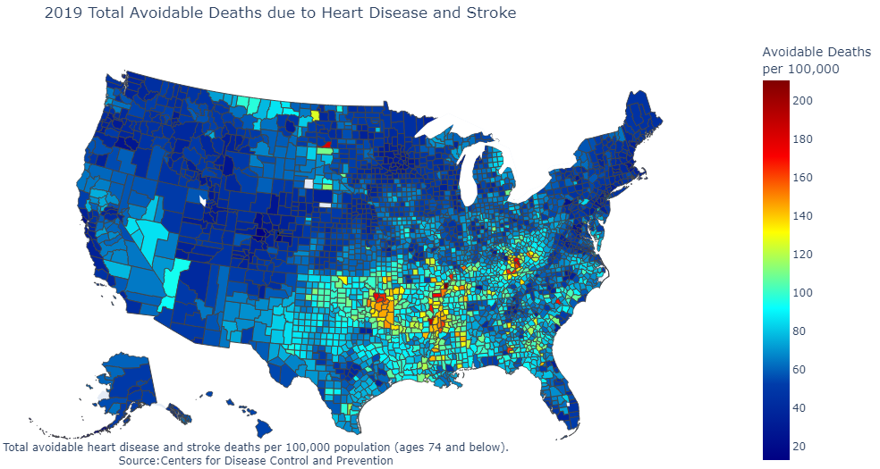
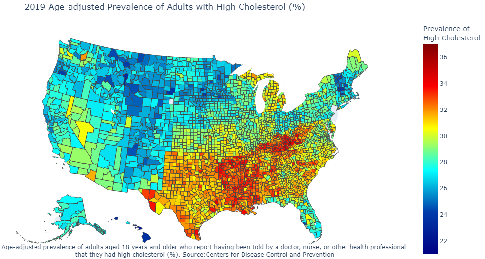
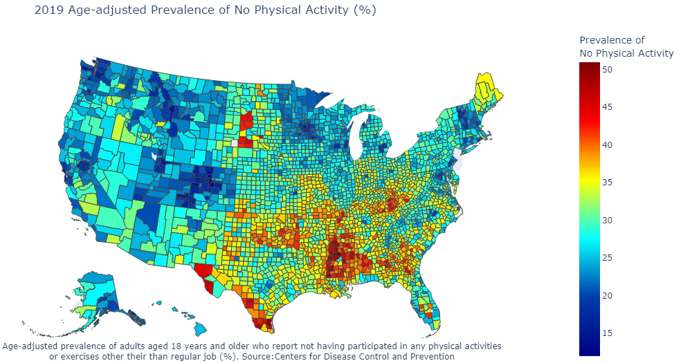

```{r setup, include=FALSE}
knitr::opts_chunk$set(echo = FALSE)
```

This project visually explores three indicators of cardiovascular health in adults across the US: 

* Avoidable deaths due to heart disease and stroke
* Prevalence of reported high cholesterol
* Prevalence of reported lack of exercise

The data is from the Agency for Healthcare Research and Quality Social Determinants of Health (SDOH) Database for the year 2019. The SDOH comprises data pulled from several sources across five core domains: social context, economic context, education, physical infrastructure, and healthcare context. 

I used choropleth maps to visualize data drawn from two Centers for Disease Control and Prevention sources within the the SDOH Database-the Interactive Atlas of Heart Disease and Stroke and the Population Level Analysis and Community Estimates: Local Data for Better Health. I completed this project in Jupyter Notebooks with the Plotly library.  You can find the source code for this project on my <a href="https://github.com/j-hook/Side-Projects/tree/main/SDOH%20projects" rel="noopener noreferrer" target="_blank"><b>GitHub</b></a>. 

```{r, echo=FALSE, out.width="200%",fig.cap="This plot represents the total number of avoidable deaths due to heart disease and stroke per 100,000 people by county. An 'avoidable death' is one that occurs in an adult under the age of 75. White spaces represent counties for which data was not available."}

```
Of the three variables of interest, the range for this indicator is the largest. Yet, there is a clear pattern of estimates at the lower end of the range for a majority of the country. This likely indicates some skewness in the data, with a smaller number of extreme values at the upper end of the range (indicated by counties in red). Compared to other regions of the US, there is a pattern of a higher number of avoidable deaths in the southeastern counties. The highest concentration of a high number of avoidable deaths, based on visual examination, appears to be in Oklahoma.

```{r, echo=FALSE, out.width="200%", fig.cap="This plot represents the prevalence of adults over the age of 18 who report they have high cholesterol accordnig to a doctor or health professional. White spaces represent counties for which data was not available."}

```

This variable has the smallest range of values. Despite reduced variability in the range for this indicator across counties overall, there is a clear pattern of higher prevalence in the southeast US (with the exception of Florida). States that appear to have lower prevalence rates across counties are relatively concentrated in the northern states of the western US, as well as New Hampshire.

```{r, echo=FALSE, out.width="200%", fig.cap="This plot represents the prevalence of adults over the age of 18 who report not participating in physical activities or exercise outside of their job. Note: White spaces represent counties for which data was not available. "}

```
Some examples of physical activities include running, walking for exercise, golf or gardening. The range of prevalence estimates here are slightly larger than the range for the cholesterol variable above.  As with previous visualizations, there is a concentration of higher prevalence of no exercise in the southeast, particularly in Mississippi counties. Interestingly, there are several counties in South Dakota with high rates of non-exercise, but these same counties have relatively low rates of both adults with high cholesterol and avoidable deaths due to heart disease and stroke.
 
### Summary
The visualizations presented above provide a broadband overview of the health of American adults based on three indicators related to cardiovascular health and physical exercise. While the data are presented in different scales, preliminary examinations of the graphs highlight geographic consistency for regions with poorer health outcomes; the southeastern US in particular. While these graphics do not directly imply a causal link between exercise and cardiovascular outcomes, physical exercise is a known modifiable risk factor for cardiovascular health. It is important to note that these graphics provide a population-level overview of these indicators and do not capture factors that may explain regional differences.  


#### Sources:
<a href="https://www.ahrq.gov/sdoh" rel="noopener noreferrer" target="_blank"><b>Area Health Resources Files (AHRF) 2009-2019. US Department of Health and Human Services, Health Resources and Services Administration, Bureau of Health Workforce, Rockville, MD</b></a>

<a href="http://nccd.cdc.gov/DHDSPAtlas" rel="noopener noreferrer" target="_blank"><b>AHRQ SDOH Database (v1), from Centers for Disease Control and Prevention, Division for Heart Disease and Stroke Prevention, Interactive Atlas of Heart Disease and Stroke</b></a>

<a href="https://chronicdata.cdc.gov/browse?category=500+Cities+%26+Places&sortBy=newest&utf8" rel="noopener noreferrer" target="_blank"><b>AHRQ SDOH Database (v1), from PLACES: Local Data for Better Health. Center for Disease Control and Prevention (2020 and 2021 Release)</b></a>
