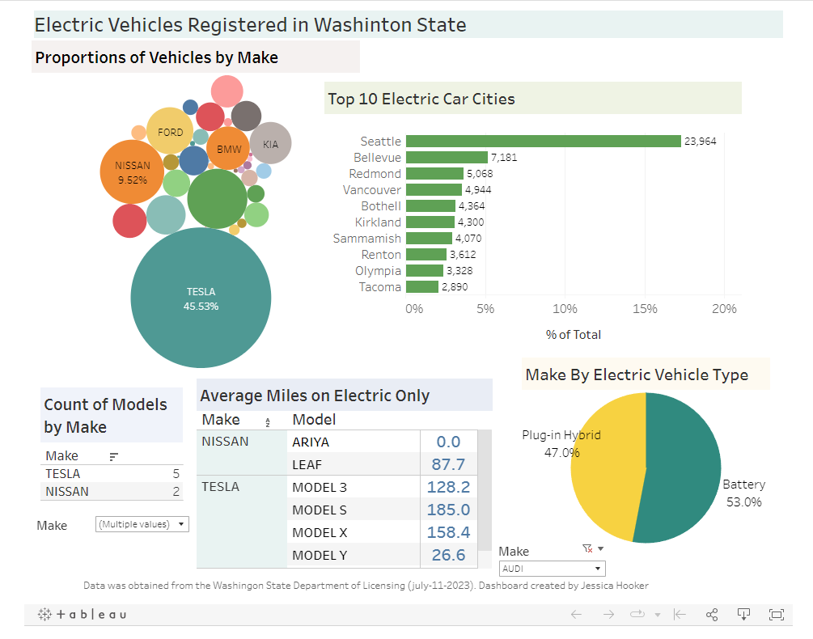

```{r setup, include=FALSE}
knitr::opts_chunk$set(echo = FALSE)
```
This was an exploratory project examining all of the electric vehicles currently registered in the state of Washington. I obtained the data set from the Department of Licensing <a href="https://data.wa.gov/Transportation/Electric-Vehicle-Population-Data/f6w7-q2d2" rel="noopener noreferrer" target="_blank"><b>here</b></a>. The data set comprises just over 138,000 registered vehicles with information that includes the make, model, year, and the number of miles that can be driven on electric power only. Using Tableau, I created a dashboard visualizing several features including the the proportion of registered cars by make and the top 10 electric car cities. This was a fun project exploring the capabilities of Tableau and the ability to quickly create an informative dashboard. 

I was surprised to see Nissan represented such a large portion of the registered vehicles at almost 10%. I was also surprised to see how much of a majority Tesla vehicles represented, but after observing how far they can travel on electric power only, it makes sense. As expected, Seattle has the most number of registered electric vehicles at 17% of all registered vehicles. Another observation I made while creating this dashboard, was that while most of the vehicles were made in the list 5 years, there were a handful that date back all the way to the late 90s. That's impressive!

You can see a snapshot of the dashboard believe or access the interactive version <a href="https://public.tableau.com/app/profile/jessica.hooker/viz/WAElectricVehicles_16892784783670/Dashboard2" rel="noopener noreferrer" target="_blank"><b>here</b></a> on Tableau Public. 


```{r, echo=FALSE, out.width="200%"}

```