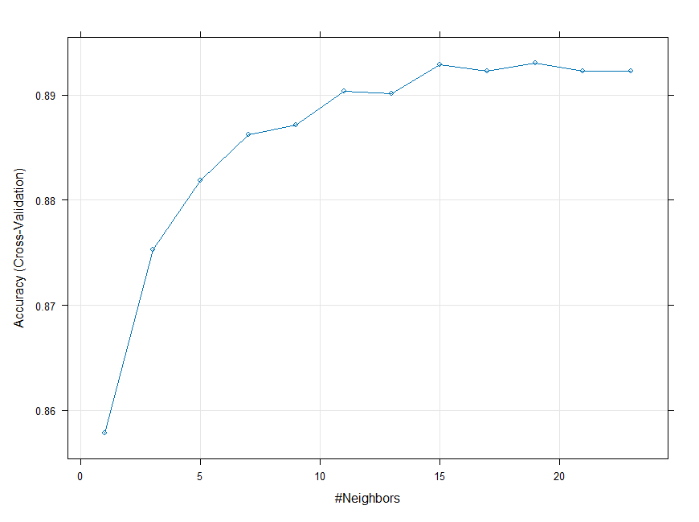
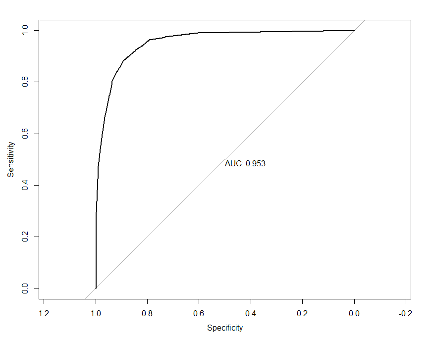
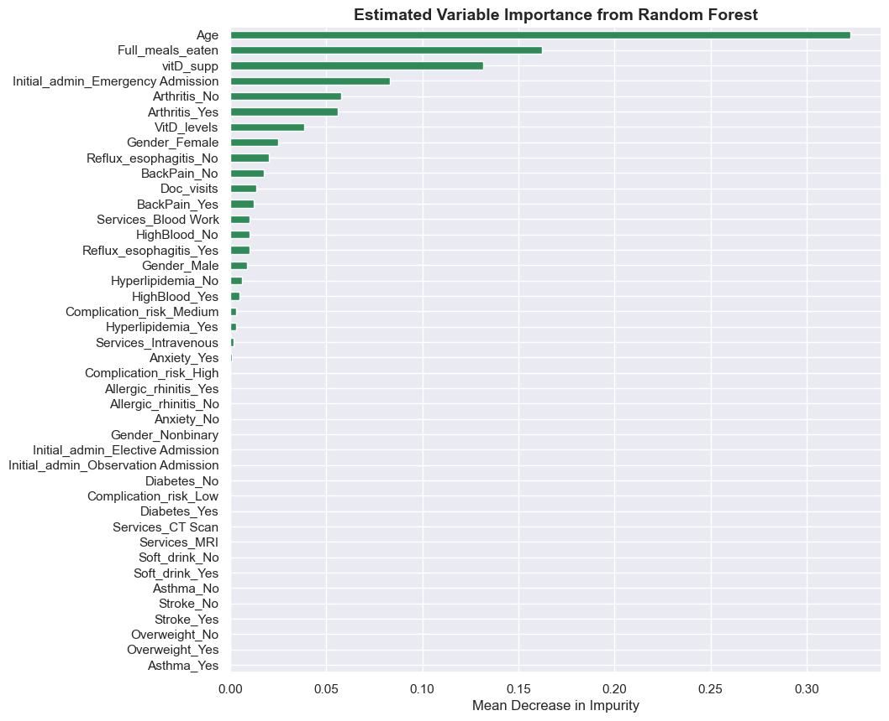

```{r setup, include=FALSE}
knitr::opts_chunk$set(echo = FALSE)
```


One of my personal goals has been to advance my analytic skills in both Python and R. I am still partial to R because I use it regularly for work and it is a powerhouse for statistical analysis, but the consistency and flexibility of Python is winning me over. I have been steadily grinding away at my master’s in data analytics at WGU over the past 6-months and my latest projects have focused on machine learning algorithms for continuous and categorical outcomes. I decided to use one tool for each project. Both projects were primarily for skill demonstration and utilized practice datasets comprising 10,000 rows and 50 variables.  After running each of them, I found both programming languages to be straightforward in their implementation, though, I would argue the pre-processing steps go much more quickly in Python. Below are brief descriptions of each project, with links to the source code on my <a href="https://github.com/j-hook/Side-Projects/" rel="noopener noreferrer" target="_blank"><b>GitHub</b></a>.

#### Project 1: Predicting Customer Churn with K-Nearest Neighbors

The primary goal of this project was to build a k-nearest neighbors (KNN) algorithm that accurately predicted whether a customer has churned from 25 customer characteristics and service features using data from a “telecommunication company.” I conducted this project in R. Prior to building the KNN model, I used recursive feature elimination with random forests and 10-fold cross-validation to narrow the features down to 8. Then, using the caret package, I performed hyperparameter tuning with cross-fold validation to identify optimal values of k.  

```{r, echo=FALSE, out.width="200%", fig.cap="This plot shows the performance of different values of k tested during hyperparameter tuning with cross-validation."}

```

With an optimal k value of 19, the final model achieved 90% accuracy on a held-out data subset. Below is the ROC curve for the final model. The code for this project can be found <a href="https://github.com/j-hook/Side-Projects/blob/main/Machine%20Learning%20projects/knn_caret_customer_churn_2024.R" rel="noopener noreferrer" target="_blank"><b> here</b></a>.    

```{r, echo=FALSE, out.width="200%", fig.cap="This is the ROC curve for the final KNN model on the held-out test data."}

```

####  Project 2: Predicting Hospitalization Length with Random Forest 

The primary goal of this project was to use random forest regression to predict patients’ length of hospitalization from their demographic, health, and treatment characteristics. I conducted this project with Python using Jupyter Notebook. For this analysis, I primarily relied on the scikit-learn library for pre-processing, hyperparameter tuning, and model building. Below is a snapshot of the variable importance estimates from the training model. Overall, this model had very poor predictive power, with only marginal improvement over the baseline model. Sometimes there aren’t relationships! Though, this is likely a facet of this practice data set. If this had been real patient data, I am confident the model would have predicted hospitalization length with a lot better accuracy. The source code for this project can be found <a href="https://github.com/j-hook/Side-Projects/blob/main/Machine%20Learning%20projects/rf_regression_hospitalization_length.ipynb" rel="noopener noreferrer" target="_blank"><b> here</b></a>.

```{r, echo=FALSE, out.width="200%", fig.cap="This plot shows the aggregrated variable importance estimates for each variable included in the random forest regression model using the training data set."}

```