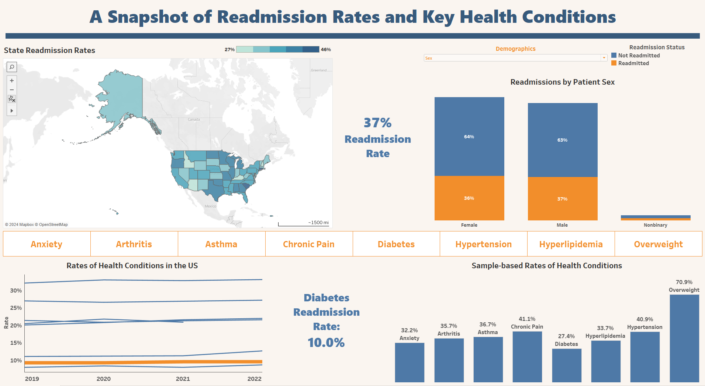
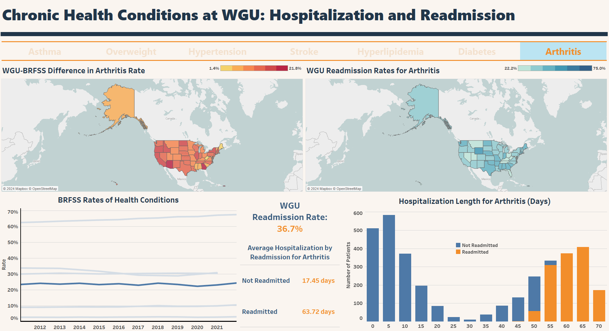

```{r setup, include=FALSE}
knitr::opts_chunk$set(echo = FALSE)
```

As part of my master's degree in Data Analytics through WGU, I've been working on mastering Tableau from a healthcare perspective. Using both fictional and publicly available health-related data from the CDC, I've created two interactive dashboards focused on chronic health conditions and hospital readmission. The fictional data was provided by WGU and represents 10,000 patients from a national hospital system who had been recently hospitalized. The WGU data set provides information about patients' health, demographics, and whether they were readmitted after the initial hospitalization.

The first dashboard paired the WGU data with the NHIS Adult Summary Health Statistics data from 2019 to 2022 (access it <a href=" https://data.cdc.gov/NCHS/NHIS-Adult-Summary-Health-Statistics/25m4-6qqq/about_data" rel="noopener noreferrer" target="_blank"><b>here</b></a>). The NHIS is a yearly national health survey conducted through the National Center for Health Statistics within the CDC and is tasked with the purpose of monitoring the health of individuals in the US. The NHIS data set was utilized because it included chronic health conditions represented in the WGU hospital data set. Specifically, the NHIS dataset includes information about the prevalence of arthritis, chronic pain, diabetes, anxiety, hypertension, obesity, asthma, and high cholesterol. Because both the WGU hospital data and the NHIS data summarize information on these health conditions, the NHIS helped to contextualize some of the insights derived from the WGU hospital data. 

You can see a snapshot of this dashboard below or access the interactive version <a href="https://public.tableau.com/app/profile/jessica.hooker/viz/WGU_NHIS_medical_dashboard/ReadmissionDashboard" rel="noopener noreferrer" target="_blank"><b>here</b></a> on Tableau Public. 


```{r, echo=FALSE, out.width="200%"}

```


The second dashboard was similar to the first with respect to its overall area of focus, however, there some notable differences. First, the complementary data set used for this dashboard came from the Behavioral Risk Factor Surveillance System, a yearly general population survey of adults in the US. For this project, I utilized the age-adjusted prevalence data from 2011 to 2022, which can be obtained from <a href="https://data.cdc.gov/Behavioral-Risk-Factors/Behavioral-Risk-Factor-Surveillance-System-BRFSS-A/d2rk-yvas/about_data" rel="noopener noreferrer" target="_blank"><b>here</b></a>.
Similar to the NHIS data above, this data included state-level estimates of chronic health conditions within the US. Second, the data for this dashboard was accessed using a connection to a postgreSQL database and a complex SQL query rather than raw CSV files. This required writing queries to create a new data table for the BRFSS data set, transform the features of interest to the correct format, and join the WGU data to the BRFSS data set. The WGU data was aggregated at the state-level and then joined to the state-level estimates in the BRFSS data. 

Below is a snapshot of this dashboard. The interactive version of this dashboard can be accessed <a href="https://public.tableau.com/app/profile/jessica.hooker/viz/ExploringChronicHealthConditionsintheWGUHospitalSystem/ConditionsDashboard" rel="noopener noreferrer" target="_blank"><b>here</b></a> on Tableau Public. 


```{r, echo=FALSE, out.width="200%"}

```


